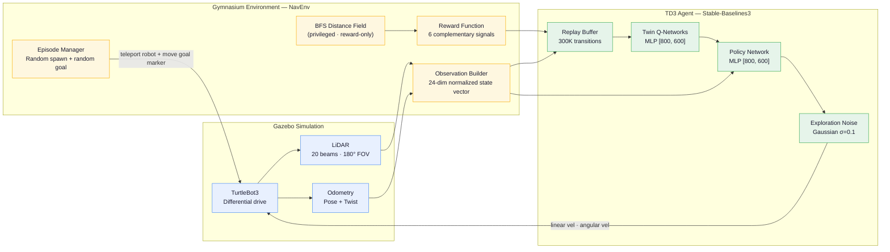
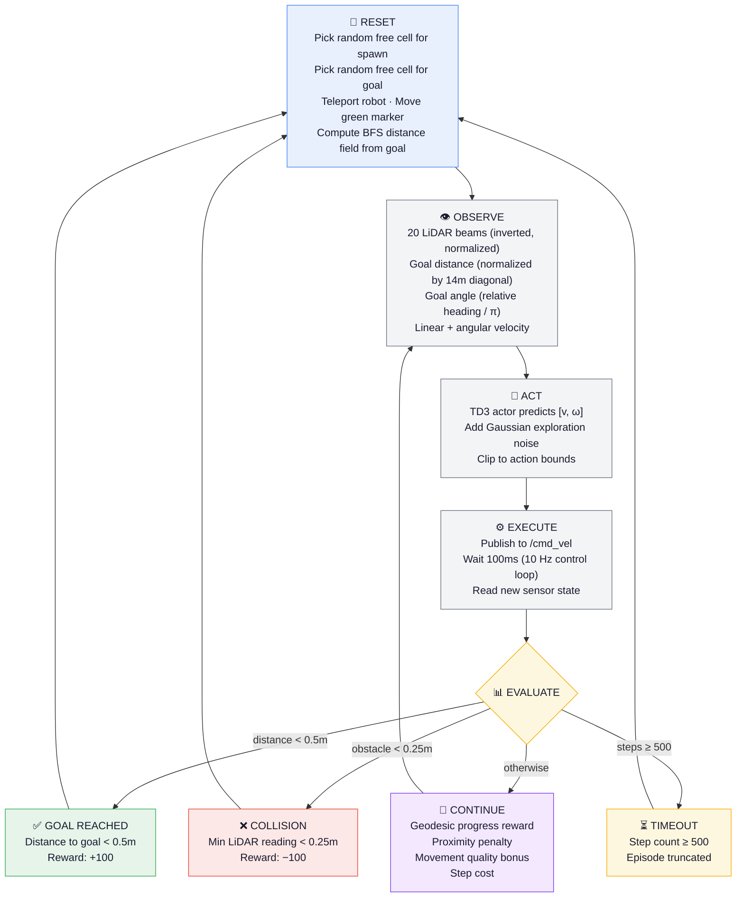

<div align="center">

# TD3-Based Autonomous Navigation in Unknown Environments

**A deep reinforcement learning system that teaches a mobile robot to navigate complex mazes using only raw sensor data — no maps, no planners, no hand-crafted rules.**

[](https://docs.ros.org/en/humble/)
[](https://python.org)
[](https://stable-baselines3.readthedocs.io/)
[](http://gazebosim.org/)

</div>

---

## Overview

This project implements a complete reinforcement learning pipeline for autonomous robot navigation. A simulated TurtleBot3 learns to reach arbitrary goal positions in maze environments using the **Twin Delayed Deep Deterministic Policy Gradient (TD3)** algorithm.

The agent's policy is learned entirely from:
- **20-beam LiDAR readings** — for reactive obstacle detection
- **Relative goal vector** — encoding distance and heading to the target

Because the observation space contains **no map information whatsoever**, the trained policy transfers directly to completely unseen environments. The BFS-based geodesic reward signal used during training is *privileged information* that shapes learning but never enters the agent's observation — a technique sometimes called **asymmetric actor-critic** or **privileged reward shaping**.

> **Result:** ~98% goal-reaching success rate on the training map, with robust zero-shot transfer to a novel maze layout the agent has never encountered.

---

## Table of Contents

- [Demos](#demos)
- [System Architecture](#system-architecture)
- [Training Pipeline](#training-pipeline)
- [Design Decisions](#design-decisions)
  - [Why TD3](#why-td3)
  - [Observation Space](#observation-space-24-dim)
  - [Action Space](#action-space-2-dim-continuous)
  - [Reward Function](#reward-function)
  - [Why It Generalizes](#why-it-generalizes-to-new-maps)
  - [Hyperparameters](#td3-hyperparameters)
- [Project Structure](#project-structure)
- [Getting Started](#getting-started)
- [Running Inference](#running-inference)
- [Resuming Training](#resuming-training)
- [Results](#results)
- [Tech Stack](#tech-stack)

---

## Demos

<div align="center">

| Training Map | Unseen Test Map (Zero-Shot Transfer) |
|:---:|:---:|
|  |  |
| The agent navigates through the maze it was trained on, reaching randomized goals with a ~98% success rate. | The **same frozen policy** is dropped into a completely new maze layout — no retraining, no fine-tuning. |
| [▶ Watch full video](demos/demo1.mp4) | [▶ Watch full video](demos/demo2.mp4) |

</div>

---

## System Architecture

The system consists of three tightly coupled layers: a **Gazebo physics simulation** providing realistic sensor feedback, a **Gymnasium environment wrapper** that translates raw ROS2 messages into RL-friendly observations and rewards, and a **TD3 agent** that learns a continuous control policy.



**Data flow at each timestep:**
1. Gazebo publishes `/scan` (LiDAR) and `/odom` (odometry) at simulation rate
2. `NavEnv` samples 20 beams from the scan, computes the relative goal vector, and assembles a 24-dim observation
3. The TD3 actor maps the observation to a 2D continuous action `[linear_vel, angular_vel]`
4. The action is published to `/cmd_vel` at 10 Hz; Gazebo advances the physics
5. The reward function evaluates progress, proximity, and terminal conditions
6. The transition `(s, a, r, s')` is stored in the replay buffer for off-policy learning

---

## Training Pipeline

Each training episode follows a cycle of randomized initialization, interaction, and outcome-based reset:



---

## Design Decisions

### Why TD3

TD3 (Twin Delayed DDPG) was chosen over alternatives like PPO, SAC, or DQN for several reasons specific to this problem:

| Requirement | TD3 Advantage |
|:---|:---|
| **Continuous velocity control** | Outputs `[linear_vel, angular_vel]` directly — no discretization artifacts that would cause jerky motion |
| **Sample efficiency** | Off-policy learning with a large replay buffer extracts more value from expensive simulation steps |
| **Stable training** | Twin critics reduce Q-value overestimation; delayed policy updates prevent premature convergence |
| **Smooth actions** | Target policy smoothing adds noise to target actions, preventing the policy from exploiting narrow peaks in the Q-function |

> **Note:** The project name references PPO (Proximal Policy Optimization), which was the original algorithm explored. TD3 was adopted after experimentation showed it produced smoother trajectories and faster convergence for this continuous control task.

### Observation Space (24-dim)

The observation is deliberately **map-free** — the agent sees only what a real robot would see through its sensors:

| Component | Dims | Range | Details |
|:---|:---:|:---:|:---|
| **LiDAR beams** | 20 | `[0, 1]` | Sampled uniformly across a 180° frontal arc. **Inverted normalization**: `1.0` = immediate obstacle, `0.0` = free space. This inversion means obstacle presence causes high activation in the neural network, which accelerates learning. |
| **Goal distance** | 1 | `[0, 1]` | Euclidean distance to goal, normalized by the arena diagonal (14m). Clipped to prevent out-of-range values. |
| **Goal angle** | 1 | `[-1, 1]` | Relative bearing to goal divided by π. Positive = goal is to the left, negative = goal is to the right. |
| **Linear velocity** | 1 | `[-0.5, 0.5]` | Current forward/backward speed from odometry. |
| **Angular velocity** | 1 | `[-1.0, 1.0]` | Current turning rate from odometry. |

### Action Space (2-dim, continuous)

| Action | Range | Description |
|:---|:---:|:---|
| **Linear velocity** | `[-0.5, 0.5]` m/s | Forward (positive) and backward (negative) speed |
| **Angular velocity** | `[-1.0, 1.0]` rad/s | Counter-clockwise (positive) and clockwise (negative) turning |

### Reward Function

The reward function combines **six carefully balanced signals** that work together to guide learning from random exploration to skilled navigation:

| Signal | Formula | Magnitude | Role |
|:---|:---|:---:|:---|
| **Goal reached** | `+REWARD_GOAL` | +100 | Sparse terminal reward — the ultimate objective |
| **Collision** | `+REWARD_COLLISION` | −100 | Sparse terminal penalty — hard constraint on safety |
| **Geodesic progress** | `GEODESIC_SCALE × (prev_D − curr_D)` | ±5 per cell | Dense shaping signal computed from BFS distance field. Rewards the agent for reducing its *maze-aware* distance to the goal, not just Euclidean distance. This is critical for learning to navigate around corners and through corridors. **This signal is privileged** — it uses map information that the agent cannot observe. |
| **Proximity penalty** | `−PROXIMITY_SCALE × (SAFE_DIST − d_min)` | up to −3.2 | Activates when any LiDAR reading falls below 0.4m. Creates a continuous repulsive force field around obstacles, teaching the robot to maintain clearance *before* a collision occurs. |
| **Movement quality** | `MOVEMENT_SCALE × (v − SPIN_PENALTY × \|ω\|)` | ±~0.5 | Encourages forward motion and penalizes excessive spinning. Without this, the agent tends to rotate in place while "searching" for the goal. |
| **Step cost** | `REWARD_STEP` | −0.1 | Small per-step penalty that encourages the agent to find shorter paths and discourages dawdling. |

### Why It Generalizes to New Maps

The generalization capability is not accidental — it is an architectural decision:

```
┌─────────────────────────────────────────────────────────────────┐
│                    WHAT THE AGENT OBSERVES                       │
│                                                                 │
│   [LiDAR₁, LiDAR₂, ..., LiDAR₂₀, d_goal, θ_goal, v, ω]       │
│                                                                 │
│   ✓ Local sensor readings     ✓ Relative goal vector            │
│   ✗ No map                    ✗ No absolute position            │
│   ✗ No obstacle locations     ✗ No path plan                    │
└─────────────────────────────────────────────────────────────────┘

┌─────────────────────────────────────────────────────────────────┐
│              WHAT TRAINING USES (BUT AGENT NEVER SEES)          │
│                                                                 │
│   BFS geodesic distance field from goal cell                    │
│   → Used ONLY in the reward function during training            │
│   → Never appears in the observation vector                     │
│   → Discarded entirely at inference time                        │
└─────────────────────────────────────────────────────────────────┘
```

Because the policy network maps `local sensors → velocity commands`, it learns **behavioral primitives** — "turn away from nearby obstacles," "steer toward the goal," "slow down in tight spaces" — rather than memorizing specific routes. These behaviors transfer to any environment with similar physics and obstacle scales.

### TD3 Hyperparameters

| Parameter | Value | Rationale |
|:---|:---:|:---|
| Network architecture | `[800, 600]` | Large enough to capture complex sensor-to-action mappings |
| Learning rate | `3e-4` | Standard for TD3; balances speed and stability |
| Replay buffer | 300,000 | ~600 episodes of experience; sufficient for off-policy diversity |
| Batch size | 256 | Large batches reduce gradient variance |
| Warmup steps | 5,000 | Random actions to fill the buffer before learning begins |
| Discount factor (γ) | 0.99 | Long planning horizon for navigating multi-step corridors |
| Soft update rate (τ) | 0.005 | Slow target network updates for training stability |
| Policy delay | 2 | Update policy every 2 critic updates (core TD3 mechanism) |
| Target noise | 0.2 (clip 0.5) | Smoothing regularization for target Q-values |
| Exploration noise | Gaussian, σ=0.1 | Moderate exploration; decays naturally as policy improves |
| Control frequency | 10 Hz | Matches real TurtleBot3 control rate |

---

## Project Structure

```
PPO_nav/
├── src/
│   ├── rl_env/                            # Core RL package
│   │   └── rl_env/
│   │       ├── nav_env.py                 # Gymnasium environment — observation, reward, reset logic
│   │       ├── ros_node.py                # ROS2 node — subscribers, publishers, Gazebo services
│   │       ├── maze_generator.py          # BFS distance field computation for reward shaping
│   │       ├── train.py                   # Training loop — TD3 with checkpoint resumption
│   │       ├── inference.py               # Inference loop — random goal cycling with logging
│   │       └── set_goal.py                # CLI utility — publish custom goal poses
│   │
│   ├── rl_robot_description/              # Robot model (URDF/Xacro with LiDAR + diff-drive)
│   ├── rl_robot_control/                  # Differential drive controller configuration
│   └── rl_robot_gazebo/                   # Simulation worlds and launch files
│       ├── launch/
│       │   ├── simulation.launch.py       # Launches training map + robot
│       │   └── simulation_test.launch.py  # Launches unseen test map + robot
│       └── worlds/
│           ├── navigation.world           # Training maze — 22 wall blocks
│           └── navigation_test.world      # Test maze — 25 wall blocks (different layout)
│
├── td3_models/
│   └── td3_nav_final.zip                  # Trained TD3 policy (210K timesteps)
│
├── demos/                                 # Demo videos (.mp4) and GIF previews
│   ├── demo1.gif / demo1.mp4              # Training map navigation
│   └── demo2.gif / demo2.mp4              # Test map generalization
│
└── README.md
```

---

## Getting Started

### Prerequisites

| Dependency | Version | Notes |
|:---|:---|:---|
| Ubuntu | 22.04 LTS | Tested on this version |
| ROS2 | Humble Hawksbill | `ros-humble-desktop` includes Gazebo 11 |
| Python | 3.10+ | Ships with Ubuntu 22.04 |
| Stable-Baselines3 | Latest | `pip install stable-baselines3` |
| Gymnasium | Latest | `pip install gymnasium` |

### Installation

```bash
# 1. Clone the repository
git clone https://github.com/Satyajit-147/TD3-AutoNav.git
cd TD3-AutoNav

# 2. Install Python dependencies
pip install stable-baselines3 gymnasium numpy

# 3. Build the ROS2 workspace
colcon build
source install/setup.bash
```

---

## Running Inference

Run the simulation and the agent in **two separate terminals**. Both terminals must source the workspace.

### On the Training Map

```bash
# Terminal 1 — launch Gazebo with the training maze
source install/setup.bash
ros2 launch rl_robot_gazebo simulation.launch.py
```

```bash
# Terminal 2 — run the trained TD3 agent
source install/setup.bash
ros2 run rl_env inference
```

### On the Unseen Test Map (Zero-Shot Transfer)

```bash
# Terminal 1 — launch Gazebo with the NEW maze layout
source install/setup.bash
ros2 launch rl_robot_gazebo simulation_test.launch.py
```

```bash
# Terminal 2 — same inference command (no changes needed)
source install/setup.bash
ros2 run rl_env inference
```

> **What you'll see:** A green sphere in Gazebo marks the current target. The robot automatically cycles through random goals. The terminal logs `✅ GOAL REACHED` and `❌ Collision` events with episode statistics.

### Setting a Custom Goal at Runtime

Open a **third terminal** to send the robot to a specific coordinate:

```bash
source install/setup.bash
ros2 run rl_env set_goal 2.0 -3.0    # send the robot to (2.0, -3.0)
```

The green goal marker will instantly teleport to the new location and the robot will redirect.

---

## Resuming Training

The training script **automatically detects and resumes from the latest checkpoint** in `td3_models/`. No manual intervention needed.

```bash
# Terminal 1 — Gazebo simulation
source install/setup.bash
ros2 launch rl_robot_gazebo simulation.launch.py
```

```bash
# Terminal 2 — training (auto-resumes)
source install/setup.bash
ros2 run rl_env train
```

Monitor live training metrics:

```bash
# Terminal 3 — TensorBoard dashboard
tensorboard --logdir td3_nav_tensorboard/
```

---

## Results

| Metric | Training Map | Test Map (Unseen) |
|:---|:---|:---|
| **Goal-reaching success rate** | ~98% across 500+ episodes | Robust navigation observed |
| **Collision avoidance** | Learned smooth proximity-based wall avoidance | Generalizes to novel obstacle configurations |
| **Path efficiency** | Takes efficient routes through corridors | Navigates previously unseen corridors and dead-ends |
| **Goal marker tracking** | Green sphere teleports to each new random goal | Same visual feedback works on any map |

---

## Tech Stack

| Layer | Technology | Role |
|:---|:---|:---|
| **RL Algorithm** | [Stable-Baselines3](https://github.com/DLR-RM/stable-baselines3) — TD3 | Off-policy continuous control with twin critics |
| **Environment** | [Gymnasium](https://gymnasium.farama.org/) — custom `NavEnv` | Wraps ROS2/Gazebo into a standard RL interface |
| **Simulation** | Gazebo 11 + ROS2 Humble | Physics, LiDAR simulation, and visualization |
| **Robot** | TurtleBot3 (custom URDF) | Differential drive with 20-beam 2D LiDAR |
| **Reward Shaping** | BFS geodesic distance field | Privileged training signal for maze-aware guidance |
