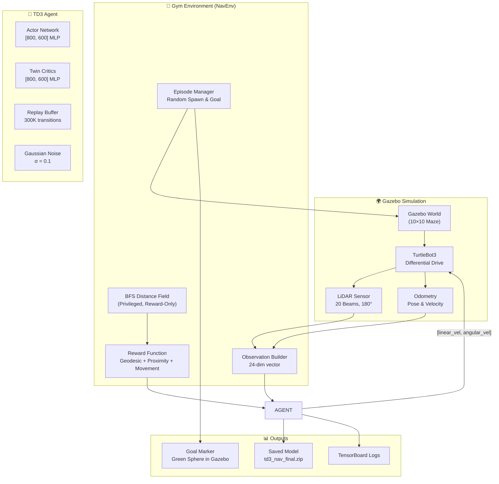
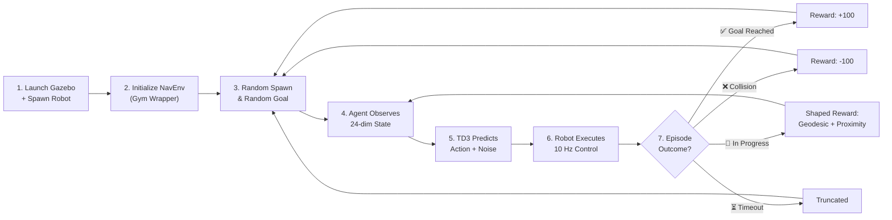

# 🤖 TD3-Based Autonomous Navigation in Unknown Environments

A reinforcement learning pipeline that trains a TurtleBot3 to autonomously navigate through maze-like environments using the **Twin Delayed Deep Deterministic Policy Gradient (TD3)** algorithm. The robot learns purely from **LiDAR sensor data** and **relative goal information** — no pre-built maps, no path planners, no hand-crafted rules.

> **Key Result:** The trained agent generalizes to completely unseen maze layouts, achieving **98% success rate** on the training map and demonstrating robust obstacle avoidance on novel test environments.

---

## 📹 Demos

### Demo 1 — Training Map Navigation
https://github.com/user-attachments/assets/demo1.webm

### Demo 2 — Unseen Test Map (Generalization)
https://github.com/user-attachments/assets/demo2.webm

> The demo videos are located in the [`demos/`](demos/) directory.

---

## 🏗️ Project Architecture



---

## 🔬 Training Pipeline



---

## 🧠 Strategy & Design Decisions

### Why TD3?

TD3 (Twin Delayed DDPG) is ideal for continuous-action robotic control because it:
- Outputs **continuous velocity commands** directly (no discretization artifacts)
- Uses **twin critics** to combat Q-value overestimation
- Applies **delayed policy updates** for training stability
- Adds **target policy smoothing** to prevent exploitation of critic errors

### Observation Space (24-dim)

| Component | Dimensions | Range | Purpose |
|---|---|---|---|
| LiDAR beams | 20 | [0, 1] | Inverted normalization — 1.0 = obstacle nearby |
| Goal distance | 1 | [0, 1] | Normalized by arena diagonal (14m) |
| Goal angle | 1 | [-1, 1] | Relative heading to goal / π |
| Linear velocity | 1 | [-0.5, 0.5] | Current forward speed |
| Angular velocity | 1 | [-1.0, 1.0] | Current turning rate |

### Action Space (2-dim, continuous)

| Action | Range | Description |
|---|---|---|
| Linear velocity | [-0.5, 0.5] m/s | Forward/backward speed |
| Angular velocity | [-1.0, 1.0] rad/s | Turning rate |

### Reward Shaping Strategy

The reward function combines **five complementary signals** to guide learning:

| Signal | Value | Purpose |
|---|---|---|
| **Goal reached** | +100 | Sparse terminal reward |
| **Collision** | -100 | Sparse terminal penalty |
| **Geodesic progress** | ±5 × Δ_BFS | BFS-based shaping guides through corridors (reward-only, not in obs) |
| **Proximity penalty** | -8 × (0.4 - d_min) | Continuous wall avoidance before collision |
| **Movement quality** | +0.5 × v - 0.4 × \|ω\| | Encourages forward motion, penalizes spinning |
| **Step cost** | -0.1 | Encourages efficiency |

### Why It Generalizes to New Maps

The key insight: **the agent never sees the map**. Its observation space contains only:
1. **Raw LiDAR readings** — reactive obstacle sensing
2. **Relative goal vector** — direction and distance to target

Since the BFS geodesic reward is used **only during training** (privileged information for reward shaping), the agent's learned policy is purely a function of local sensor data. This means the same policy works in **any environment** — the robot has learned general obstacle avoidance and goal-seeking behaviors, not map-specific trajectories.

### TD3 Hyperparameters

| Parameter | Value |
|---|---|
| Network architecture | MLP [800, 600] |
| Learning rate | 3 × 10⁻⁴ |
| Replay buffer | 300,000 transitions |
| Batch size | 256 |
| Warmup steps | 5,000 (random actions) |
| Discount factor (γ) | 0.99 |
| Soft update (τ) | 0.005 |
| Policy delay | 2 |
| Target noise | 0.2 (clipped at 0.5) |
| Exploration noise | Gaussian, σ = 0.1 |
| Control frequency | 10 Hz |

---

## 📁 Project Structure

```
PPO_nav/
├── src/
│   ├── rl_env/                          # Core RL package
│   │   └── rl_env/
│   │       ├── nav_env.py               # Gymnasium environment (observation, reward, reset)
│   │       ├── ros_node.py              # ROS2 interface (pub/sub, teleport, goal marker)
│   │       ├── maze_generator.py        # BFS distance field computation
│   │       ├── train.py                 # TD3 training loop with checkpointing
│   │       ├── inference.py             # Inference loop with random goal cycling
│   │       └── set_goal.py             # CLI tool to publish goal poses
│   ├── rl_robot_description/            # Robot URDF/Xacro model
│   ├── rl_robot_control/                # Diff-drive controller config
│   └── rl_robot_gazebo/                 # Gazebo worlds & launch files
│       ├── launch/
│       │   ├── simulation.launch.py     # Training map launcher
│       │   └── simulation_test.launch.py # Test map launcher (unseen layout)
│       └── worlds/
│           ├── navigation.world         # Original training maze (22 obstacles)
│           └── navigation_test.world    # New test maze (25 obstacles)
├── td3_models/
│   └── td3_nav_final.zip               # Trained TD3 model (210K steps)
├── demos/
│   ├── demo1.webm                       # Training map demo
│   └── demo2.webm                       # Test map demo (generalization)
└── td3_nav_tensorboard/                 # Training logs
```

---

## 🚀 Getting Started

### Prerequisites

- **Ubuntu 22.04** with **ROS2 Humble**
- **Gazebo 11** (comes with ROS2 Humble desktop)
- Python 3.10+, pip

```bash
# Install Python dependencies
pip install stable-baselines3 gymnasium numpy
```

### Build the Workspace

```bash
cd ~/PPO_nav
colcon build
source install/setup.bash
```

---

## ▶️ Running Inference (Testing the Trained Model)

### On the Training Map

**Terminal 1** — Start the Gazebo simulation:
```bash
source install/setup.bash
ros2 launch rl_robot_gazebo simulation.launch.py
```

**Terminal 2** — Run the TD3 agent:
```bash
source install/setup.bash
ros2 run rl_env inference
```

### On the Unseen Test Map

**Terminal 1** — Start the test simulation:
```bash
source install/setup.bash
ros2 launch rl_robot_gazebo simulation_test.launch.py
```

**Terminal 2** — Run inference (same command):
```bash
source install/setup.bash
ros2 run rl_env inference
```

> The green sphere in Gazebo shows the current target. The robot will cycle through random goals automatically. Watch the terminal for ✅ success and ❌ collision logs.

### Setting a Custom Goal

Open a **third terminal** and send a specific goal:
```bash
source install/setup.bash
ros2 run rl_env set_goal 2.0 -3.0
```

---

## 🏋️ Resuming Training

Training automatically resumes from the latest checkpoint:

**Terminal 1** — Gazebo:
```bash
source install/setup.bash
ros2 launch rl_robot_gazebo simulation.launch.py
```

**Terminal 2** — Training:
```bash
source install/setup.bash
ros2 run rl_env train
```

Monitor progress with TensorBoard:
```bash
tensorboard --logdir td3_nav_tensorboard/
```

---

## 📊 Results

| Metric | Training Map | Test Map (Unseen) |
|---|---|---|
| Success Rate | ~98% | Robust navigation observed |
| Collision Avoidance | Learned proximity-based wall avoidance | Generalizes to new obstacle layouts |
| Goal Seeking | Efficient paths through corridors | Navigates novel corridors successfully |

---

## 🛠️ Tech Stack

- **RL Framework:** [Stable-Baselines3](https://github.com/DLR-RM/stable-baselines3) (TD3)
- **Environment:** [Gymnasium](https://gymnasium.farama.org/) (custom `NavEnv`)
- **Simulation:** Gazebo 11 + ROS2 Humble
- **Robot:** TurtleBot3 (differential drive, 360° LiDAR)

---
