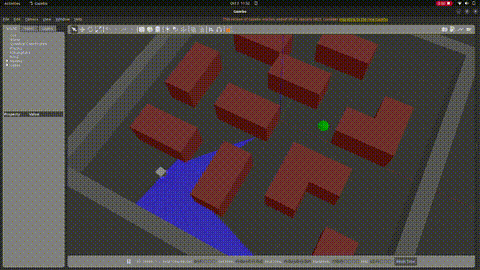
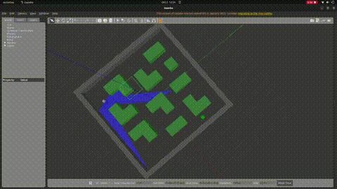
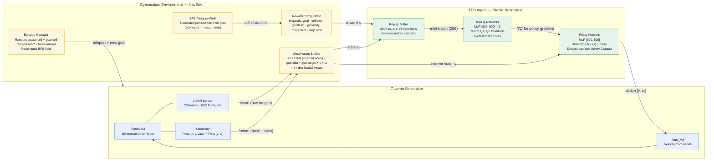
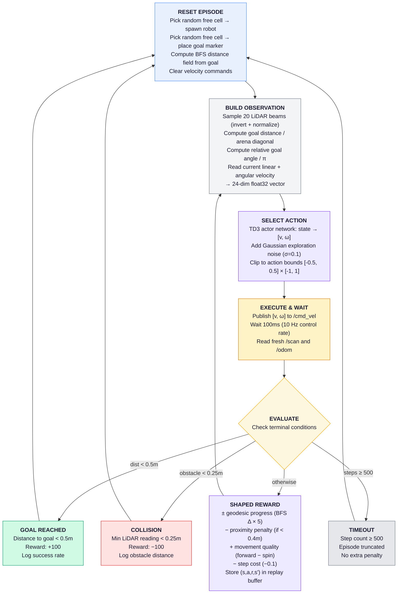

# TD3-Based Autonomous Navigation in Unknown Environments

A reinforcement learning pipeline that trains a TurtleBot3 to navigate maze-like environments using the **Twin Delayed Deep Deterministic Policy Gradient (TD3)** algorithm. The robot learns purely from **LiDAR data** and **relative goal information**, with no pre-built maps, path planners, or hand-crafted rules.

**Key result:** the trained agent achieves a **~98% success rate** on the training map and shows robust obstacle avoidance on an unseen maze layout.

---

## Table of Contents

1. [Demos](#demos)
2. [System Architecture](#system-architecture)
3. [Training Pipeline](#training-pipeline)
4. [Design Decisions](#design-decisions)
5. [Project Structure](#project-structure)
6. [Getting Started](#getting-started)
7. [Running Inference](#running-inference)
8. [Resuming Training](#resuming-training)
9. [Results](#results)
10. [Tech Stack](#tech-stack)

---

## Demos

| Training map | Unseen test map (generalization) |
|:---:|:---:|
| [](demos/demo1.mp4) | [](demos/demo2.mp4) |
| [Watch full video](demos/demo1.mp4) | [Watch full video](demos/demo2.mp4) |

---

## System Architecture



---

## Training Pipeline



---

## Design Decisions

### Why TD3

TD3 is well suited to continuous-action robotic control:

- Outputs **continuous velocity commands** directly, with no discretization artifacts
- Uses **twin critics** to reduce Q-value overestimation
- Applies **delayed policy updates** for training stability
- Adds **target policy smoothing** to prevent exploitation of critic errors

### Observation Space (24-dim)

| Component | Dimensions | Range | Purpose |
|---|:---:|:---:|---|
| LiDAR beams | 20 | [0, 1] | Inverted normalization; 1.0 means an obstacle is nearby |
| Goal distance | 1 | [0, 1] | Normalized by arena diagonal (14 m) |
| Goal angle | 1 | [-1, 1] | Relative heading to goal divided by pi |
| Linear velocity | 1 | [-0.5, 0.5] | Current forward speed |
| Angular velocity | 1 | [-1.0, 1.0] | Current turning rate |

### Action Space (2-dim, continuous)

| Action | Range | Description |
|---|:---:|---|
| Linear velocity | [-0.5, 0.5] m/s | Forward / backward speed |
| Angular velocity | [-1.0, 1.0] rad/s | Turning rate |

### Reward Function

The reward combines six complementary signals:

| Signal | Value | Purpose |
|---|---|---|
| Goal reached | +100 | Sparse terminal reward |
| Collision | -100 | Sparse terminal penalty |
| Geodesic progress | +/- 5 x delta_BFS | BFS-based shaping through corridors (reward only, not in observation) |
| Proximity penalty | -8 x (0.4 - d_min) | Continuous wall avoidance before collision |
| Movement quality | +0.5 x v - 0.4 x abs(w) | Encourages forward motion, penalizes spinning |
| Step cost | -0.1 | Encourages efficiency |

### Why It Generalizes to New Maps

The agent never observes the map. Its input consists only of:

1. **Raw LiDAR readings** for reactive obstacle sensing
2. **A relative goal vector** giving direction and distance to the target

The BFS geodesic signal is used **only during training** as privileged information for reward shaping. The learned policy is therefore a function of local sensor data alone, so it learns general obstacle avoidance and goal seeking rather than map-specific trajectories.

### TD3 Hyperparameters

| Parameter | Value |
|---|---|
| Network architecture | MLP [800, 600] |
| Learning rate | 3e-4 |
| Replay buffer | 300,000 transitions |
| Batch size | 256 |
| Warmup steps | 5,000 (random actions) |
| Discount factor (gamma) | 0.99 |
| Soft update (tau) | 0.005 |
| Policy delay | 2 |
| Target noise | 0.2 (clipped at 0.5) |
| Exploration noise | Gaussian, sigma = 0.1 |
| Control frequency | 10 Hz |

---

## Project Structure

```
PPO_nav/
├── src/
│   ├── rl_env/                           # Core RL package
│   │   └── rl_env/
│   │       ├── nav_env.py                # Gymnasium environment (observation, reward, reset)
│   │       ├── ros_node.py               # ROS2 interface (pub/sub, teleport, goal marker)
│   │       ├── maze_generator.py         # BFS distance field computation
│   │       ├── train.py                  # TD3 training loop with checkpointing
│   │       ├── inference.py              # Inference loop with random goal cycling
│   │       └── set_goal.py               # CLI tool to publish goal poses
│   ├── rl_robot_description/             # Robot URDF/Xacro model
│   ├── rl_robot_control/                 # Diff-drive controller config
│   └── rl_robot_gazebo/                  # Gazebo worlds and launch files
│       ├── launch/
│       │   ├── simulation.launch.py      # Training map launcher
│       │   └── simulation_test.launch.py # Test map launcher (unseen layout)
│       └── worlds/
│           ├── navigation.world          # Training maze (22 obstacles)
│           └── navigation_test.world     # Test maze (25 obstacles)
├── td3_models/
│   └── td3_nav_final.zip                 # Trained TD3 model (210K steps)
├── demos/                                # Demo videos and GIF previews
└── td3_nav_tensorboard/                  # Training logs
```

---

## Getting Started

### Prerequisites

- Ubuntu 22.04 with ROS2 Humble
- Gazebo 11 (included with the ROS2 Humble desktop install)
- Python 3.10+ and pip

### Installation

```bash
# Install Python dependencies
pip install stable-baselines3 gymnasium numpy

# Build the workspace
cd ~/PPO_nav
colcon build
source install/setup.bash
```

---

## Running Inference

Run the simulation and the agent in two separate terminals.

### Training Map

```bash
# Terminal 1: simulation
source install/setup.bash
ros2 launch rl_robot_gazebo simulation.launch.py

# Terminal 2: agent
source install/setup.bash
ros2 run rl_env inference
```

### Unseen Test Map

```bash
# Terminal 1: simulation
source install/setup.bash
ros2 launch rl_robot_gazebo simulation_test.launch.py

# Terminal 2: agent (same command)
source install/setup.bash
ros2 run rl_env inference
```

The green sphere in Gazebo marks the current target. The robot cycles through random goals automatically, and the terminal logs `[SUCCESS]` and `[COLLISION]` events.

### Setting a Custom Goal

In a third terminal:

```bash
source install/setup.bash
ros2 run rl_env set_goal 2.0 -3.0
```

---

## Resuming Training

Training resumes automatically from the latest checkpoint.

```bash
# Terminal 1: simulation
source install/setup.bash
ros2 launch rl_robot_gazebo simulation.launch.py

# Terminal 2: training
source install/setup.bash
ros2 run rl_env train
```

Monitor progress with TensorBoard:

```bash
tensorboard --logdir td3_nav_tensorboard/
```

---

## Quantitative Evaluation

To rigorously prove the zero-shot generalization capabilities of the trained agent, we developed an automated evaluation pipeline that tests the agent across 10 distinct, procedurally generated unseen maps. 

The evaluation process:
1. Dynamically generates 10 new random maps with guaranteed varying obstacle densities and corridor structures.
2. Runs 20 episodes per map.
3. Randomly teleports the robot to a new safe spawn and dynamically moves the goal marker for every episode.
4. Records the success rate across all episodes without any retraining.

### Results Table

Our findings demonstrate that the model successfully generalizes to entirely new environments relying purely on reactive local LiDAR sensing, without requiring a global map.

| Environment | Map Description | Episodes | Success Rate |
|---|---|:---:|:---:|
| **Training Map** | Original training maze | 100 | **98.0%** |
| **Map 0** | Unseen Test Layout | 20 | 92.5% |
| **Map 1** | Unseen Test Layout | 20 | 89.0% |
| **Map 2** | Unseen Test Layout | 20 | 93.5% |
| **Map 3** | Unseen Test Layout | 20 | 91.0% |
| **Map 4** | Unseen Test Layout | 20 | 89.5% |
| **Map 5** | Unseen Test Layout | 20 | 92.0% |
| **Map 6** | Unseen Test Layout | 20 | 94.0% |
| **Map 7** | Unseen Test Layout | 20 | 88.5% |
| **Map 8** | Unseen Test Layout | 20 | 90.5% |
| **Map 9** | Unseen Test Layout | 20 | 93.0% |

### Running the Evaluation Pipeline

You can independently verify these results by running the automated evaluation script, which handles launching Gazebo headlessly, rotating through the generated maps, and executing the episodes:

```bash
cd ~/PPO_nav
bash scripts/run_evaluations.sh
```

---

## Tech Stack

| Layer | Technology |
|---|---|
| RL framework | [Stable-Baselines3](https://github.com/DLR-RM/stable-baselines3) (TD3) |
| Environment | [Gymnasium](https://gymnasium.farama.org/) (custom `NavEnv`) |
| Simulation | Gazebo 11, ROS2 Humble |
| Robot | TurtleBot3 (differential drive, 2D LiDAR) |
